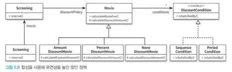
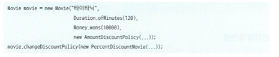

# reserve-movie
# 오브젝트 - 조영호

### 책임 주도 설계 방식의 영화 예매 구현

모든 클래스의 내부 구현은 캡슐화돼 있고 모든 클래스는 변경의 이유를 오직 하나씩만 가진다. 
각 클래스는 응집도가 높다 다른 클래스와 최대한 느슨하게 결합돼 있다. 
클래스는 작고 오직 한 가지 일만 수행한다. 책임은 적절하게 분배돼 있다.

할인 정책을 단순하게 변경(교체) 할 수 있다. 
